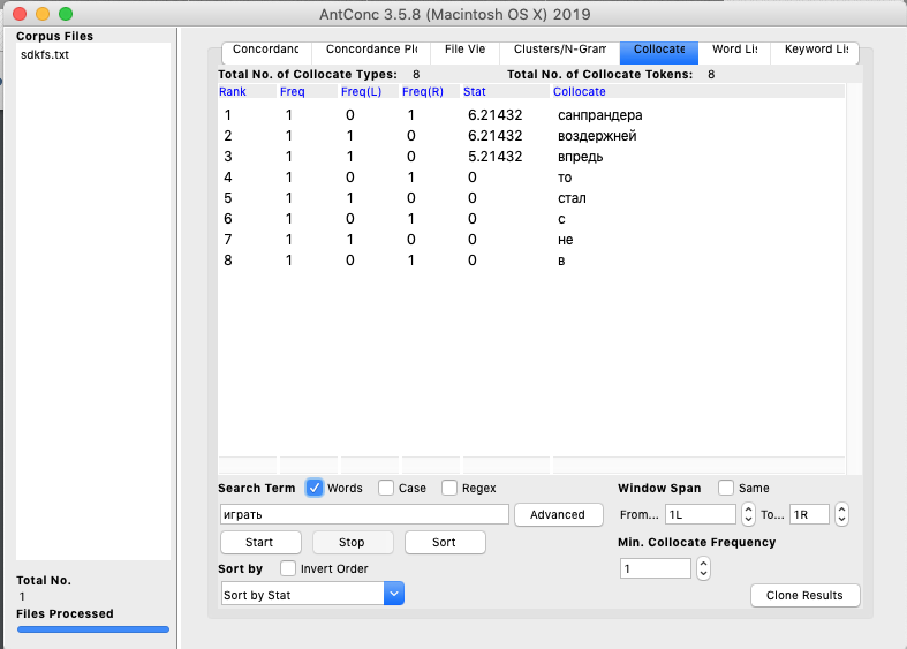
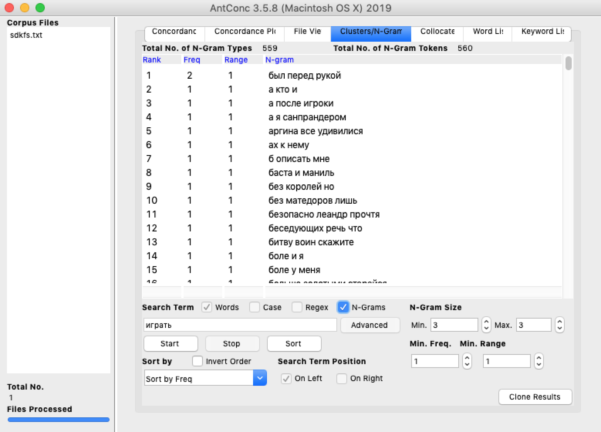
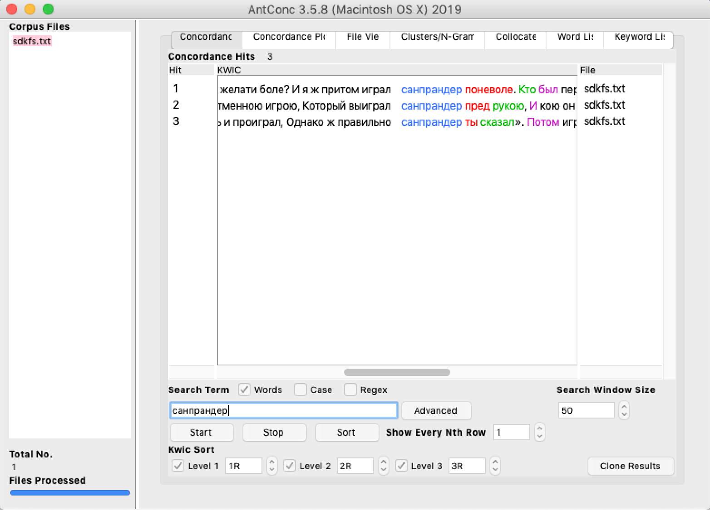
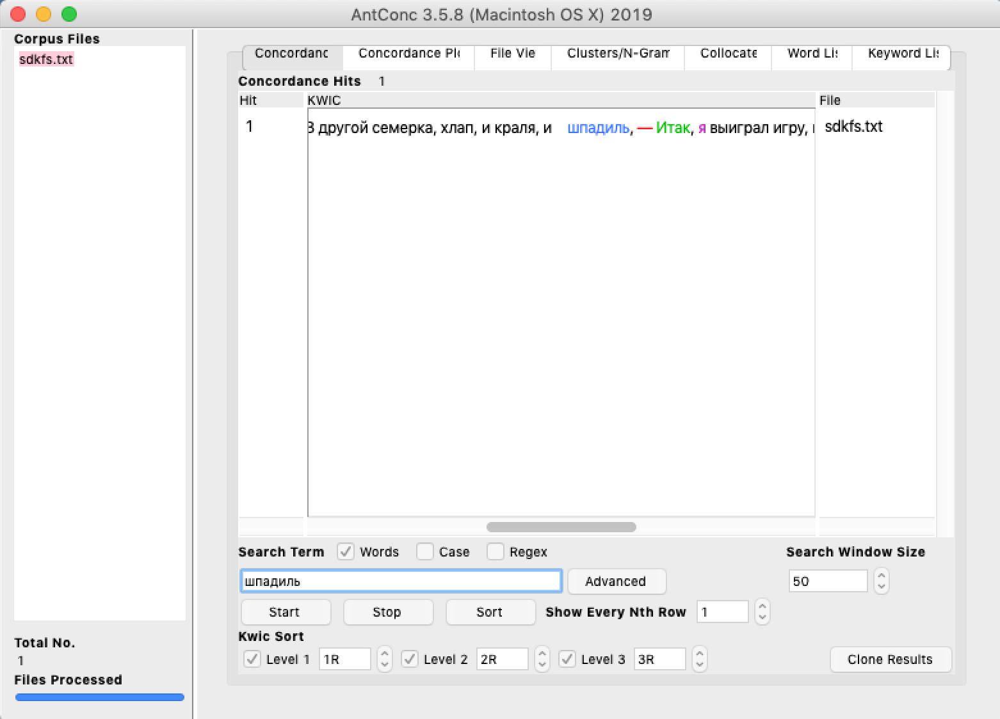
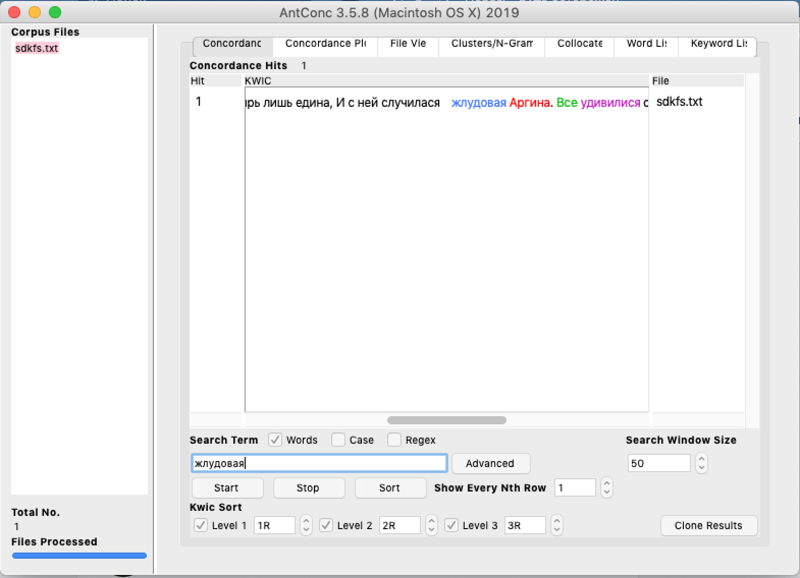
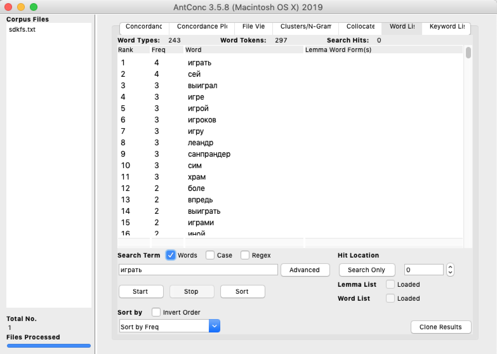

# HW3

1. AntConc

2. Google NGrams и НКРЯ

  Утеха и Развлечение
 
 Судя по Google NGrams, слово "утеха" чаще всего было использовано в период с 1795-1797, впервые его употребление было зафкисровано в 1777 году. Затем, в начале 19 века произошел спад, но практически стабильно фиксируется его употребление по сей день. Исходя из графиков НКРЯ, самое частое его использование было в 18 веке - чаще всего в период 1723-1726, но после 1877 произошел спад. Возможно, анализ двух корпусов приводит к разным результатам, так как объем НКРЯ включает больше нужных текстов, нежели Google NGrams. Что касается слова "Развлечение", в графике google ngrams видно, что его употребление фиксируется с конца 18 века. Затем, после 1920, заметен рост частоты его использования, чаще всего - после 2000. Анализируя НКРЯ, стоит отметить, что его употребление также фиксируется в конце 18 века, а самое большая частота - в 1876. Возможно, в НКРЯ меньше современных источников, чем в Google NGrams.
 
  Коль и Если
   
 Слово "Коль", по Google NGrams, чаще всего использовалось в 1782, однако затем происходил постепенный спад, затем, в итоге, частота его использования стала близка к нулю с начала 19 века, теперь фиксируется стабильное редкое употребление его в источниках. Что касается графиков НКРЯ, частота использования слова "коль" высока в середине 18 века. Стоит отметить ее спад после данного периода, а также резкий рост употребления с 1983-1995. Возможно, в произведениях упоминается имя "Коля" в этой форме, бывшее в то время популярным среди писателей. Современный аналог, "Если", исходя из графиков google ngrams, стал часто употребляться после 1820 века, но гораздо реже, чем "Коль". По сей день фиксируется стабильное употребление, но после 1920 начал происходить спад. График НКРЯ, в свою очередь, говорит нам о том, что в период с 1734 слово "если" используется часто и стабильно, но самая высокая точка графика отмечена в 2008 году, а самая низкая в 1710.
   
 Очи и Глаза
   
 Анализируя график частоты употребления слова "Очи" в Google Ngrams, заметно, что самое частое использование зафиксировано во второй половине 18 века, а самая высокая точка графика в 1782 году. После 1820 года происходит спад, и в наше время оно практически не используется. Судя по графику НКРЯ, самые частые его употребления зафиксированы как во второй половине 18 века,так и в период 1826-1843. На данный момент его использование так же низко, как и в google ngrams. Что касается современного слова-синонима "Глаза", исходя из графика google ngrams, его употребление началось во второй половине 18 века и до наших дней оно употребляется так же часто, однако самая низкая точка графика в 1722 году, и его использование все еще варьируется. Судя по графику НКРЯ, его употребление также началось во второй половине 18 века, но на нем заметнее спады и рост частоты, но самая высокая точка графика в 1959 году, как и в google ngrams в 1944.
   
  ipm "утеха" = 0,539812...
  ipm "коль" = 11,618308...
  ipm "очи" = 12,034634...
   
3. Использование инструментов корпусного анализа в профессиональной деятельности.

   Корпусный анализ помогает филологу узнать частоту употребления слова в любой период времени. Также благодаря заданию я узнала современные аналоги слов "шпадиль", "жлудовая" и "санпрандер", но у большинства из них было ноль вхождений, поэтому я нашла другие устаревшие слова. Навык расчета ipm, поиск и анализ графиков, по-моему, важны для будущей профессиональной деятельности, ведь я только на цифровой грамотности пользуюсь НКРЯ. О, а еще умение пользоваться им и гитхабом помогли мне выиграть в своей игре на паре :)
   
   
